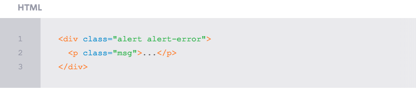
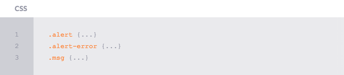

# Perfomance and Organization

Ter a habilidade de [escrever HTML e CSS](http://learn.shayhowe.com/html-css/writing-your-best-code/) com um sólido entendimento é uma grande expertise para se ter. Com o crescimento da base de código e o tráfego dos site, um novo conjunto de habilidades entra em jogo, habilidades que são extremamente importantes tanto para o momento de desenvolvimento quanto para a experiência do usuário. Conhecer os fundamentos de performance e organização de site pode tomar um bom tempo.

A organização e arquitetura de uma base de código pode afetar imensamente não apenas a velocidade de desenvolvimento, mas também a velocidade com que cada página é renderizada. Ambos os quais podem ser preocupações consideráveis não só para desenvolvedores, mas também para usuários. Levar um tempo para criar a estrutura certa para a base de código, e identificar como todos os diferentes componentes vão trabalhar juntos, pode acelerar a produção e entregar uma experiência melhor para todos a volta. 

Além disso, tomar alguns pequenos passos para melhorar o desempenho de um site pode pagar em dividendos. [Perfomance de sites](http://stevesouders.com/hpws/rules.php) lembra muito a regra 80/20, onde 20% das otimizações vai acelerar cerca de 80% do site.

## Strategy & Structure

A primeira parte para melhorar a performance e organização de sites gira em torno de identificar uma boa estratégia e estrutura para o desenvolvimento da base de código. Especificamente, criar uma forte arquitetura de diretórios, que defina os padrões de design, e encontrar formas de reutilização de código comum.

### Style Architecture

Exatamente como organizar estilos e o que é melhor para um certo site é uma decisão pessoal, mas geralmente, há boas práticas a se seguir. Uma prática inclui separar estilos com base na intenção, o que inclui a criação de diretórios para estilos de base comum, componentes de interface e módulos da lógica de negócios.

 

A arquitetura esboçada acima inclui três diretórios, todos com grupos individuais de estilos. O objetivo aqui é **começar a pensar em sites como um sistema** mais do que páginas individuais, e a arquitetura do código deve refletir esta mentalidade. Observe como não existe nenhum estilo específico de página aqui.

O diretório `base` inclui estilos e variáveis comuns a serem utilizados ao longo de todos os estilos do site, layout e tipografia, por exemplo. O diretório `components` inclui estilos para elementos específicos de interface e que são separados em diferentes arquivos, como alerts e buttons. Por último, o diretório `modules` inclui estilos para diferentes seções de uma página, e que são determinadas pelas necessidades do negócio.

Os componentes de estilos são puramente orientados a interface e não têm nada a ver com a lógica de negócios do site. Módulos em seguida incluem estilos específicos para a lógica do negócio. Quando criando a marcação de um módulo em HTML é comum o uso de diferentes componentes de interface dentro dele. Por exemplo, o sidebar de uma página pode ter um estilos de lists e buttons que são definidos dentro de estilos de componentes, enquanto outros estilos necessários para o sidebar são herdados dos estilos dos módulos. A separação de estilos incentiva conjuntos bem pensados e dá a capacidade de estilos serem amplamente compartilhados e reutilizados.

A estratégia de organizar estilos desta forma não é exatamente nova, e foi anteriormente mencionada em diferentes metodologias de CSS, incluindo *Object Oriented CSS, OOCSS*, e *Scalable and Modular Architecture for CSS, SMACSS.* Essas metodologias possuem suas próprias opiniões sobre a estrutura, como também sobre como utilizar estilos.

### Object Oriented CSS

A metodologia [Object Oriented CSS](http://oocss.org/) foi iniciada por Nicole Sullivan em seu trabalho escrevendo estilos para grandes sites. Object Oriented CSS identifica dois princípios que vão ajudar a construir sites escaláveis, com uma forte arquitetura e uma quantidade razoável de código. Estes dois principios incluem: 

- Estrutura separada das interface

- Conteúdo separado dos containers

No geral, **separar a estrutura da interface** inclui abstrair o layout de um elemento do tema de uma site. A estrutura de uma módulo deve ser transparente, permitindo que outros estilos sejam herdados e exibidos sem conflitos. Mais comumente, isso requer uma estrutura de grid e um layout sólido, juntamente com módulos bem trabalhados. 

Separar o conteúdo dos containers envolve a remoção de dependências de um elemento pai envolvendo um elemento filho. Um título deve ter a mesma aparência independentemente da sua área de conteúdo. Para conseguir isso, os elementos precisam herdar estilos padrões, e então serem estendidos com múltiplas classes, se necessário.

Object Oriented CSS defende a construção de uma biblioteca de componentes, mantendo a flexibilidade, e utilizando um grid. Estas são boas regras básicas, e elas pode te ajudar a evitar a necessidade de adicionar estilos adicionais cada vez que você adicionar uma nova página ou uma novo recurso para um site. 

### Scalable & Modular Architecture for CSS

Na mesma linha do Object Oriented CSS está a metodologia [Scalable & Modular Architecture for CSS](http://smacss.com/) desenvolvida por Jonathan Snook. A Scalable & Modular Architecture for CSS promove a de quebrar estilos em cinco categorias principais, incluindo: 

- Base

- Layout

- Module

- State

- Theme

A categoria `base` inclui estilos de elementos principais, cobrindo os padrões gerais. A categoria `layout`, em seguida, identifica os estilos dimensionamento e grid de diferentes elementos, determinando seu layout. Estilos de `module` são estilos mais específicos voltados para partes individuais de uma página, tais como navegação ou estilos de recursos. Os estilos de `state` são então utilizados para aumentar ou substituir outros estilos no caso em que um módulo inclui um estado alternativo, uma aba ativa, por exemplo. Por últimp, a categoria de `theme` pode ser adicionado, o que pode incluir estilos baseados em torno da interface, ou aparência e experiência, de diferentes módulos.

No exemplo acima a classe `alert` se encaixa dentro da categoria `module` enquanto que a classe `is-error` se encaixa dentro da categoria `state`. Estilos de cada uma dessas categorias são então herdadas caso necessário.

### Choosing a Methodology