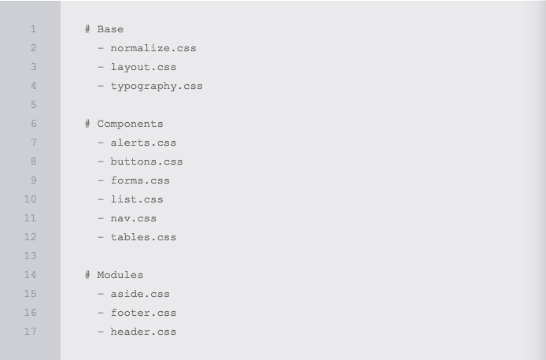

# Perfomance and Organization

Ter a habilidade de [escrever HTML e CSS](http://learn.shayhowe.com/html-css/writing-your-best-code/) com um sólido entendimento é uma grande expertise para se ter. Com o crescimento da base de código e o tráfego dos site, um novo conjunto de habilidades entra em jogo, habilidades que são extremamente importantes tanto para o momento de desenvolvimento quanto para a experiência do usuário. Conhecer os fundamentos de performance e organização de site pode tomar um bom tempo.

A organização e arquitetura de uma base de cógido pode afetar imensamente não apenas a velocidade de desenvolvimento, mas também a velocidade com que cada página é renderizada. Ambos os quais podem ser preocupações consideráveis não só para desenvolvedores, mas também para usuários. Levar um tempo para criar a estrutura certa para a base de código, e identificar como todos os diferentes componentes vão trabalhar juntos, pode acelerar a produção e entregar uma experiência melhor para todos a volta. 

Além disso, tomar alguns pequenos passos para melhorar o desempenho de um site pode pagar em dividendos. [Perfomance de sites](http://stevesouders.com/hpws/rules.php) lembra muito a regra 80/20, onde 20% das otimizações vai acelerar cerca de 80% do site.

## Strategy & Structure

A primeira parte para melhorar a performance e organização de sites gira em torno de identificar uma boa estratégia e estrutura para o desenvolvimento da base de código. Especificamente, criar uma forte arquitetura de diretórios, que defina os padrões de design, e enontrar formas de reutilização de código comum.

### Style Architecture

Exatamente como organizar estilos e o que é melhor para um certo site é uma decisão pessoal, mas geralmente, há boas práticas a se seguir. Uma prática inclui separar estilos com base na intenção, o que inclui a criação de diretórios para estilos de base comum, componentes de interface e módulos da lógica de negócios.

 

A arquiterura esboçada acima inclui três diretórios, todos com grupos individuais de estilos. O objetivo aqui é **começar a pensar em sites como um sistema** mais do que páginas individuais, e a arquitetura do código deve refletir esta mentalidade. Observe como não existe nenhum estilo específico de página aqui.

O diretório `base` inclui estilos e variáveis comuns a serem utilizados ao longo de todos os estilos do site, layout e tipografia, por exemplo. O diretório `components` inclui estilos para elementos específicos de interface e que são separados em diferentes arquivos, como alerts e buttons. Por último, o diretório `modules` inclui estilos para diferentes seções de uma página, e que são determinadas pelas necessidades do negócio.

